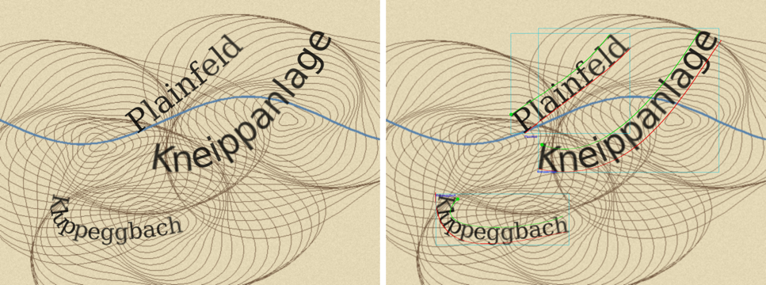

# CartoSynth

Synthetic map tiles with text annotations, for training text spotting models
(detection + recognition) on historical maps.

CartoSynth draws place names and numbers onto text-free map backgrounds, in fonts made
from the lettering of your maps, degrades them like printed and scanned ink, and writes
pixel-exact annotations in the COCO/AdelaiDet format used by ABCNet, DeepSolo,
DNTextSpotter and MapTextPipeline.



*Example with the bundled demo background and a standard font. Green/red: upper/lower
bezier of each word, dot: reading start.*

## Contents

- [Quick start](#quick-start)
- [How it works](#how-it-works)
- [Using your own maps](#using-your-own-maps)
  - [1. Backgrounds (required)](#1-backgrounds-required)
  - [2. Words](#2-words)
  - [3. Fonts](#3-fonts)
  - [4. Config](#4-config)
- [Output](#output)
- [Commands](#commands)
- [Without Docker / VS Code devcontainer](#without-docker--vs-code-devcontainer)
- [Project structure](#project-structure)
- [Troubleshooting](#troubleshooting)
- [Licences and attribution](#licences-and-attribution) (code: MIT)

## Quick start

You only need **Docker** (Linux, macOS or Windows with WSL2).

```bash
git clone https://github.com/danielseisenbacher/SynthMap.git CartoSynth
cd CartoSynth
./cartosynth.sh generate config/default.yaml -n 5    # builds the Docker image on first use (~5 min)
./cartosynth.sh visualize output/example             # annotation overlays -> output/example/previews/
```

This draws 5 tiles onto the two demo backgrounds in `examples/backgrounds/` with DejaVu
fonts, writes `output/example/annotations.json` and checks the result. For real training
data you need your own backgrounds, words and fonts (next sections).

## How it works

```
word list ─┐
numbers  ──┼─► 1 layout ─► 2 text to paths ─► 3 glyph effects ─► 4 background ─► 5 render ─► 6 annotations
fonts    ──┘   baselines    + bezier fitting    blur, frayed ink    behind text     PNG + scan   COCO JSON
```

1. **Layout**: 2-5 labels per tile (configurable). Each gets a font style that can render
   it, a size, an ink colour and a baseline (curved for words, straight for numbers) that
   stays on the tile and away from the other labels.
2. **Text to paths**: Inkscape converts the text to glyph outlines. For every word an upper
   and a lower cubic bezier are fitted around its letters: this is the annotation.
3. **Glyph effects**: opacity, blur and optionally frayed edges per glyph.
4. **Background**: the background image goes behind the text; the tile gets its size.
5. **Render**: PNG via Inkscape, optionally with scan blur and JPEG artefacts.
6. **Annotations**: COCO JSON, then a consistency check (see [Output](#output)).

Words the annotation dictionary cannot encode are removed from the word list *before*
rendering, so every visible word has a complete label.

## Using your own maps

Create a config (e.g. `config/myproject.yaml`) that overrides only what differs from
[`config/default.yaml`](config/default.yaml) (every option is documented there), then run
`./cartosynth.sh generate config/myproject.yaml`.
[`config/3la.yaml`](config/3la.yaml) is a complete real example (Austro-Hungarian
3rd Military Survey, 1:75,000).

### 1. Backgrounds (required)

CartoSynth draws text **onto** your background images, so they must be **free of text**:
any text left in a background ends up in the training data without a label and teaches
the model to ignore text. Backgrounds should look like your maps (colours, hachures,
line work, scan quality) at the resolution you train on.

Put them into a folder, e.g. `data/backgrounds/myproject/` (PNG or JPG, any size, each
tile takes the size of its background; used in order, repeated if there are fewer
backgrounds than tiles), and set:

```yaml
backgrounds:
  dir: data/backgrounds/myproject
```

Ways to get text-free backgrounds (scripts in [`tools/backgrounds/`](tools/backgrounds/)):

| Way | How |
|---|---|
| Map areas without text | crop them by hand from your scans; quick, but little variety |
| **AI redrawing** | `cut_patches.py` cuts random patches from your scans; `remove_text_ai.py` has an image model (OpenAI) redraw each patch as a *new*, text-free map extent in the same style; `cut_subtiles.py` cuts several smaller tiles out of each result. **Costs money per image** (the script prints the estimate) and results must be checked for leftover text. |
| Retouching | remove the text from scans in an image editor or with inpainting |
| Text-free editions | some map series exist without lettering (printing plates, "stumme Karten") |

```bash
python tools/backgrounds/cut_patches.py -i scans/ -o patches/ -n 300 --min-size 500 --max-size 1000
export OPENAI_API_KEY=...        # never put the key into a file in the repo
python tools/backgrounds/remove_text_ai.py -i patches/ -o generated/ --limit 20   # try a few first
python tools/backgrounds/cut_subtiles.py -i generated/ -o data/backgrounds/myproject -n 4 --min-size 300 --max-size 800
```

(`remove_text_ai.py` needs `pip install openai pillow` on the host; the other two only Pillow,
or run them in the container: `./cartosynth.sh shell`.)

### 2. Words

A word list is a UTF-8 text file with one label per line (labels may contain spaces; they
are annotated word by word). `data/words/` contains Austrian place names from
OpenStreetMap (`austria_small.txt`: ~3,200 names balanced over categories;
`austria_full.txt`: ~49,000). For another country:

```bash
./cartosynth.sh words CH switzerland    # -> data/words/switzerland_full.txt, switzerland_small.txt (~10 min)
```

```yaml
words:
  file: data/words/switzerland_small.txt
  shuffle: true
```

Numbers (elevations, grid numbers, ...) are generated, not read from the list: set
`numbers.share` to the fraction of labels that are numbers and adjust their value
distribution (`numbers.*` in the default config).

### 3. Fonts

Each **font style** in the config names a font family and says what it can render:

```yaml
fonts:
  styles:
    - {family: DejaVu Serif, size: [30, 60], letters: true, digits: true, uppercase: true, lowercase: true, fallback: true}
    - {family: mymap_caps,   size: [30, 60], letters: true, digits: false, uppercase: true, lowercase: false, fallback: false}
```

`uppercase: false` / `lowercase: false` lower-/upper-cases labels drawn in that style
(for fonts that only exist in one case). One style must have `fallback: true`.

There are two ways to get fonts:

**a) Ready-made fonts.** Any font installed in the container (`./cartosynth.sh fonts --list`)
or a `.ttf`/`.otf` you put into `data/fonts/files/`. Use the family name the list shows.
Historical-looking free fonts are a good start, but a model trained on them learns their
letter shapes, not your map's.

**b) Custom fonts from your map's lettering** (what `config/3la.yaml` uses). You cut out
single letters from the scans and CartoSynth turns each set into a font:

1. For each lettering style of your map (e.g. italic lowercase for waters, bold capitals
   for regions), create a folder `data/fonts/glyph_scans/<family>/`.
2. Cut out one clean example per character, tightly cropped, as PNG/JPG/TIF, named after
   the character: `A.png`, `a.png`, `0.png`, `ä.png`, or `U+00E4.png` (use the `U+` form on
   macOS/Windows, where `A.png` and `a.png` would be the same file).
   Dark letters on light paper are fine; the background is removed automatically.
   Letters you do not provide keep the shape of the base font.
3. Vectorise them and build the fonts:
   ```bash
   ./cartosynth.sh glyphs                               # -> data/fonts/glyph_images/, data/fonts/glyphs/<family>/*.svg
   ./cartosynth.sh fonts --config config/myproject.yaml # -> data/fonts/build/<family>.otf + coverage check
   ```
   Check the SVGs in `data/fonts/glyphs/`: stains or fragments there end up in every
   rendered letter. You can also draw or fix glyphs as SVG by hand and skip step 3's first command.

How the font is built: every glyph is scaled to the height of the same letter in the
**base font** (default DejaVu Sans; another one via `--base-font` or
`data/fonts/base/BaseFont.ttf`) and placed on its baseline; letters you did not provide
come from the base font. Accented letters are composed from your letter plus the base
font's accent (ä = your `a` + dots), so umlauts match the rest of the word.

The **coverage check** after every build lists, per style, characters of your word list the
font cannot draw (Inkscape would silently use another font for them). `generate` refuses to
start if a configured family is not installed.

### 4. Config

Most important options (full list with defaults in [`config/default.yaml`](config/default.yaml)):

| Option | Meaning |
|---|---|
| `run_name`, `num_maps`, `seed` | output folder `output/<run_name>/`, number of tiles, seed for reproducible runs |
| `backgrounds.dir` | text-free background images |
| `words.file` | word list |
| `labels_per_map` | `[min, max]` labels per tile |
| `fonts.styles` | font styles, see above |
| `numbers.*` | share, size and value distribution of numeric labels, optional point markers |
| `ink.*` | label colours (numbers can get their own, e.g. red) |
| `effects.*` | glyph opacity, blur, frayed edges (`roughness`), scan simulation |
| `annotation.vocabulary` | dictionary of your model: `voc96` (AdelaiDet/ABCNet/DeepSolo), `voc148` (MapTextPipeline), or a file with one character per line |
| `annotation.max_length` | length of `rec` (25 for DeepSolo/MapTextPipeline) |
| `annotation.case_fallback` | characters encoded as another one, e.g. `{"Ö": "ö"}` |

Command line overrides: `-n/--num-maps`, `--run-name`, `--seed`.

Tip: compare real and synthetic data before generating thousands of tiles: fraction of
numbers, label height in px, ink colour, curvature, how much the text blends into the
background. `check` prints the label statistics of a run.

## Output

```
output/<run_name>/
├── images/<n>.png            the tiles
├── annotations.json          COCO annotations (name: annotation.file_name)
├── config.yaml               the exact config of this run
├── previews/                 annotation overlays (visualize) and bezier fits (SVG)
└── svg/1_text ... 4_background   intermediate stages (keep_intermediate: false removes 2-4)
```

Annotation format (per word):

```json
{
  "id": 0, "image_id": 3, "category_id": 1, "iscrowd": 0, "area": 0,
  "bezier_pts": [x0, y0, ..., x7, y7],
  "rec": [51, 84, 72, ..., 148],
  "transcription": "Mühlbach",
  "bbox": [x, y, w, h]
}
```

- `bezier_pts`: 4 control points of the **upper** curve from left to right (reading
  direction), then 4 of the **lower** curve from right to left (AdelaiDet convention).
- `rec`: character indices in the configured dictionary, padded to `max_length` with the
  padding index (96 for voc96, 148 for voc148). The "unknown" index is never used.

`./cartosynth.sh check output/<run_name>` verifies that every image exists, every drawn word
has exactly one annotation (and vice versa), `rec` matches the transcription and the bezier
order is correct. `generate` runs it automatically at the end.

## Commands

All commands run in Docker via `./cartosynth.sh <command>` (image built on first use,
outputs belong to your user):

| Command | Does |
|---|---|
| `generate <config> [-n N] [--run-name X] [--seed S] [--overwrite]` | generate a dataset (refuses to overwrite an existing run) |
| `check <run folder>` | verify a run |
| `visualize <run folder> [--limit N]` | annotation overlays into `<run>/previews/` |
| `fonts [--config C] [--base-font F] [--check-only] [--list]` | build custom fonts, check coverage |
| `glyphs [--force]` | letter images → glyph SVGs |
| `words <country code> <name>` | place names from OpenStreetMap |
| `test` | run the test suite |
| `shell` | shell in the container |
| `build` | rebuild the image (after changing `docker/Dockerfile` or `requirements.txt`) |

Speed: about 2-4 s per tile (Inkscape), i.e. 1-2 h for 2,000 tiles. For long runs in the
background: `nohup ./cartosynth.sh generate config/myproject.yaml > generate.log 2>&1 &`

## Without Docker / VS Code devcontainer

**VS Code**: "Reopen in Container" uses the same image ([`.devcontainer/`](.devcontainer/));
run `python -m cartosynth <command>` in its terminal.

**Native** (Linux): install Inkscape ≥ 1.2, FontForge (with Python scripting),
fontconfig, Python ≥ 3.10, then

```bash
pip install -r requirements.txt
python -m cartosynth fonts --install      # copies the fonts to ~/.local/share/fonts
python -m cartosynth generate config/default.yaml -n 5
```

## Project structure

```
cartosynth.sh           Docker wrapper, entry point
config/                 default.yaml (all options) + project configs
cartosynth/             Python package (python -m cartosynth)
  cli.py pipeline.py    commands, stage order
  layout.py             label placement (stage 1)
  beziers.py            text to paths + bezier fitting (stage 2)
  effects.py render.py  glyph effects, background, PNG (stages 3-5)
  coco.py vocab.py      annotations, dictionaries (stage 6)
  words.py osm.py       word lists
  fonts.py glyphs.py fontforge_build.py   custom fonts
  check.py visualize.py
data/
  backgrounds/          your backgrounds (not in git)
  fonts/                glyph_scans/ glyph_images/ glyphs/ (your letters), files/ (ready-made fonts), build/
  words/                word lists
examples/backgrounds/   two procedural demo backgrounds
tools/backgrounds/      making text-free backgrounds
docker/                 Dockerfile, fontconfig setup
tests/                  ./cartosynth.sh test
output/                 generated runs (not in git)
```

## Troubleshooting

| Problem | Solution |
|---|---|
| `generate` says a font style is NOT FOUND | build it (`fonts`), put the font file into `data/fonts/files/`, or fix the family name (`fonts --list`) |
| letters in another font than configured | the coverage check lists missing characters: add those glyphs or choose a base font that has them |
| `... already exists` | use another `--run-name` or `--overwrite` |
| tiles are blank / white | `backgrounds.dir` is wrong or empty (warning at the start) |
| permission errors on old outputs | files created by older versions as root: `docker run --rm -v "$PWD":/w alpine chown -R $(id -u):$(id -g) /w` |
| image changes not picked up | `./cartosynth.sh build` |

## Licences and attribution

- CartoSynth (code, configs, demo backgrounds and the glyph outlines in
  `data/fonts/glyphs/`, traced from sheets of the Austro-Hungarian 3rd Military Survey,
  1869-1887) is released under the [MIT licence](LICENSE).
- Word lists in `data/words/` are derived from OpenStreetMap data,
  © OpenStreetMap contributors, available under the
  [Open Database License (ODbL)](https://www.openstreetmap.org/copyright). Keep this
  attribution when you publish data generated from them.
- Custom fonts built with the default base font include glyphs of DejaVu Sans
  ([DejaVu fonts licence](https://dejavu-fonts.github.io/License.html), free to modify
  and redistribute under a different name).
- Backgrounds made with `remove_text_ai.py` are subject to the terms of the image model
  you use.
